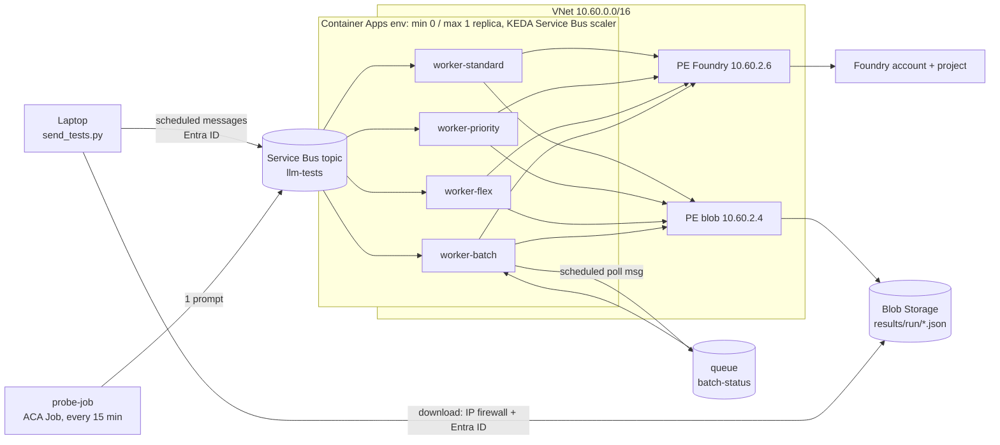

# Azure OpenAI service tiers: Standard vs Priority vs Flex (+ Batch reference) – a real, measured demo

This repository deploys a small but realistic **queue-driven, scale-to-zero application on Azure Container Apps** and
uses it to compare the processing options for the same model in Microsoft Foundry (Azure OpenAI):

| Processing option | What it is | Price | Application pattern |
|---|---|---|---|
| **Standard** (`service_tier="default"`) | normal pay-as-you-go request/response | list price | request/response |
| **Priority** (`service_tier="priority"`) | same endpoint, same deployment, same quota, prioritized low-latency processing with a latency target ([docs](https://learn.microsoft.com/en-us/azure/foundry/openai/concepts/priority-processing)) | **2× Standard** | request/response – *same code*; may be downgraded to Standard (then billed as Standard) |
| **Flex** (`service_tier="flex"`) | same endpoint, same deployment, same quota, lower-priority spare capacity ([docs](https://learn.microsoft.com/en-us/azure/foundry/openai/how-to/flex-processing)) | **50 % off** | request/response – *same code*; longer/variable latency and 429s |
| **Global Batch** *(historical reference)* | offline jobs submitted as JSONL files, 24 h completion window | 50 % off | submit → persist state → poll → download file |

The focus is **Standard vs Priority vs Flex**: three price/latency points behind one API parameter. Batch is kept as the
older way to get the 50 % discount, to show what Flex saves you architecturally.

Everything in this repo was actually deployed and executed; the report [`results/report.html`](results/report.html) is
generated from the real result files in [`results/blobs`](results/blobs).

## Models and deployments

Not every model supports every processing option. At the time of writing Flex is supported only by `gpt-5.6-sol`
(2026-07-09); the same model also supports Priority, but has no Global Batch deployment type. To always compare like with
like:

| Comparison | Model | Deployment(s) |
|---|---|---|
| **Standard vs Priority vs Flex** (main) | `gpt-5.6-sol` 2026-07-09 | `gpt-56-sol` (GlobalStandard, capacity 100) – *the same deployment for all three tiers* |
| Standard vs Batch (reference) | `gpt-5.4-mini` 2026-03-17 | `gpt-54-mini` (GlobalStandard, 100) and `gpt-54-mini-batch` (GlobalBatch, 100) |

In the result files and report the main comparison is "pair A" and the Batch reference "pair B".

## Architecture



* One Service Bus message = one **test run** (a few prompts). The topic fans it out to four subscriptions
  (`standard`, `priority`, `flex`, `batch`), so all workers process exactly the same prompts at the same moment. Runs are
  sent as *scheduled messages* 15 min apart – longer than the KEDA cool-down (300 s) – so every run also measures a real
  **scale-from-zero** cold start.
* All Container Apps run the **same image**; `WORKER_MODE` selects `standard`, `priority`, `flex` or `batch`.
* **Identity:** one user-assigned managed identity is attached to all workers and used for Service Bus, Storage, Foundry,
  ACR pull and the KEDA scaler. Key auth is disabled on Storage (`allowSharedKeyAccess: false`), Foundry and Service Bus
  (`disableLocalAuth: true`). The laptop uses the operator's Azure CLI login. There are no keys, SAS tokens or connection
  strings anywhere.
* **Network:** the ACA environment is VNet-integrated. Storage and Foundry have private endpoints; the
  `privatelink.blob.core.windows.net`, `privatelink.openai.azure.com`, `privatelink.cognitiveservices.azure.com` and
  `privatelink.services.ai.azure.com` zones are linked to the VNet. Workers record the IPs they resolve (`10.60.2.x`) and the
  Storage access log confirms their calls come from `10.60.x.x` with OAuth. The storage account denies public traffic except
  for allow-listed operator IPs and carries the tag `SecurityControl=Ignore`. (Foundry keeps public access enabled so the
  operator can smoke-test from the laptop; Service Bus Standard has no private endpoints and is reached with Entra ID.)

## Impact on the application

**Standard → Priority / Flex: one parameter.** The Standard, Priority and Flex workers call literally the same function
([`worker/app/llm.py`](worker/app/llm.py)):

```python
client.chat.completions.create(
    model=deployment,
    messages=[{"role": "user", "content": prompt}],
    service_tier=service_tier,   # "default" | "priority" | "flex" – the only difference
    reasoning_effort="low",
    max_completion_tokens=1000,
)
```

* **Priority** needs nothing else. It can also be switched on for a whole deployment (`properties.service_tier: priority`,
  requests then use `auto`) without touching code. The application should read `response.service_tier`: a Priority request
  can be **downgraded** to Standard (ramp-up of > 50 % TPM within 15 min, peak periods, long context) and is then billed as
  Standard.
* **Flex** needs a long client timeout (900 s, as recommended by the docs) and retry with backoff on HTTP 429 – both good
  practice anyway. Queue-driven asynchronous processing absorbs extra latency naturally.

**Standard → Batch (reference): a different architecture** ([`worker/app/batch_worker.py`](worker/app/batch_worker.py)): build JSONL
with the GlobalBatch deployment name in every line → upload a file → wait until it is processed → create a batch job →
persist job state (blob), because the worker may scale to zero → schedule a poll message (Service Bus, +60 s) and repeat until
`completed/failed/expired` → download output and error files → correlate lines by `custom_id`. It also needs a separate
GlobalBatch deployment, a second queue + KEDA rule and durable state.

## Day-and-night probe

The main campaign covers a few hours of one working day. Because Flex runs on spare, preemptible capacity, its latency and
429 rate depend on regional load, and the docs recommend off-peak hours (nights, weekends); Priority, on the other hand,
may be downgraded at peak times. A **scheduled Container Apps
Job** `probe-job` ([`worker/app/probe.py`](worker/app/probe.py), cron `*/15 * * * *`, same image, `WORKER_MODE=probe`) therefore
sends one short prompt to the same topic every 15 minutes, 24/7. Run IDs are `probe-YYYYMMDD-HHMM` (UTC slot) and the prompt
rotates deterministically. Each probe hits a cold worker (the gap is longer than the 300 s cool-down). The report groups
results by 3-hour UTC buckets and by weekday vs weekend. Deploy with `-ProbeCron ''` to skip the job, or stop it with
`az containerapp job delete -n probe-job -g rg-openai-flex-demo`.

## Metering and billing

How the tiers appear in Azure metering and billing (verified in this subscription; see section 8 of the report):

| | Standard | Priority | Flex | Global Batch (reference) |
|---|---|---|---|---|
| Deployment | GlobalStandard | **the same** GlobalStandard deployment | **the same** GlobalStandard deployment | separate GlobalBatch deployment |
| Quota | deployment TPM/RPM | **shared** with Standard | **shared** with Standard | separate enqueued-token quota |
| Selecting it | default | `service_tier="priority"` or deployment default `priority` | `service_tier="flex"` | Batch API (files + jobs) |
| Header alternative | `x-ms-service-tier: default` | `x-ms-service-tier: priority` | `x-ms-service-tier: flex` | – |
| Billing meter | Standard meters, e.g. `5.6 sol ShortCo Inp Std Gl` | **dedicated PP meters**, e.g. `5.6 sol ShortCo Inp PP Gl` | **dedicated Flex meters**, e.g. `54 mini Inp Flex Gl` | Batch meters, e.g. `5.4 mini Batch Inp Gl` |
| Price gpt-5.6-sol ($/1M in / cached / out) | 4 / 0.40 / 20 | **8 / 0.80 / 40** | 2 / 0.20 / 10 (50 %, no public meter yet) | n/a |
| Price gpt-5.4-mini ($/1M in / out) | 0.75 / 4.50 | – | 0.375 / 2.25 | 0.375 / 2.25 |
| When it can't be served | – | **downgraded** to Standard, billed as Standard | HTTP 429, **not billed**, no automatic fallback | job may expire |
| Azure Monitor | `ServiceTierRequest/Response = default` | `… = priority` (downgrade: request ≠ response) | `… = flex` | own deployment name |

* **Separate meters, same resource.** Priority and Flex tokens go to their own meter IDs, so Cost analysis (group by
  *Meter*) separates them from Standard even though all hit one deployment. At the time of testing there was **no published
  Flex meter for gpt-5.6-sol**, so the report estimates its Flex cost as 50 % of the Standard meter and shows the meters
  actually charged from Cost Management (data lags 8–24 h).
* **Metrics.** `ModelRequests`, `AzureOpenAIRequests`, `ProcessedPromptTokens`, `GeneratedTokens`, `TokenTransaction` and the
  latency metrics have `ServiceTierRequest` and `ServiceTierResponse` dimensions. `InputTokens`, `OutputTokens` and
  `TotalTokens` do not.
* **Check the tier in the response.** Asking for `service_tier="flex"` on a model where Flex is not available
  (gpt-5.4-mini here) was **not rejected** in our tests: the request was served and billed as `default` (HTTP 200), although
  the Flex docs state such requests return HTTP 400 since 25 Sep 2026. Likewise, a downgraded Priority request returns
  `default`. The response field `service_tier` (and `ServiceTierResponse` in metrics) is the only way to tell; the workers
  record it for every request, and [`scripts/check_tier_support.py`](scripts/check_tier_support.py) tests every tier on every
  deployment.

`scripts/collect_billing_evidence.py` collects all three sources (metrics by tier, Cost Management by meter, retail prices)
into `results/billing_evidence.json`.

## Repository layout

```
infra/main.bicep                     all Azure resources (resource-group scope), incl. the probe Container Apps Job
infra/deploy.ps1                     infra → image build in ACR → apps; writes outputs.json (-ProbeCron to change/skip probe)
infra/allow-my-ip.ps1                add an IP/CIDR to the storage firewall
worker/                              container image (Python 3.13): main.py, llm.py (Standard+Priority+Flex), online_worker.py,
                                     batch_worker.py, probe.py (scheduled probe sender), prompts.py, common.py
scripts/send_tests.py                send a campaign of scheduled test runs to Service Bus
scripts/download_results.py          download result blobs to results/blobs/ (incremental; --full to re-download)
scripts/collect_network_evidence.py  Storage access-log evidence (caller IP + auth type) from Log Analytics
scripts/collect_billing_evidence.py  metrics by service tier, Cost Management by meter, retail prices
scripts/check_tier_support.py        request default/priority/flex on each deployment, record the tier that actually served it
scripts/build_report.py              self-contained HTML report (inline SVG charts, no external assets)
results/                             manifests, downloaded blobs, evidence JSON, report.html
```

## How to run

Prerequisites: Azure CLI logged in (with rights to create role assignments), PowerShell 7, [uv](https://docs.astral.sh/uv/).

```powershell
./infra/deploy.ps1                         # region swedencentral, RG rg-openai-flex-demo
uv sync
cd scripts
uv run python send_tests.py --campaign main --runs 24 --interval-min 15 --start-delay-min 2 --prompts 5
# ... wait until all runs and batch jobs have finished ...
uv run python download_results.py
uv run python collect_network_evidence.py
uv run python collect_billing_evidence.py
uv run python check_tier_support.py
uv run python build_report.py --campaign main --campaign probe --out ..\results\report.html
```

**Laptop access to Storage behind a corporate proxy:** `deploy.ps1` allow-lists the IP returned by `api.ipify.org`, but a
secure web gateway may send Storage traffic from a different egress IP (here `4.194.122.x`). If the download fails with
`AuthorizationFailure` (403), look up the real address in Log Analytics
(`StorageBlobLogs | where StatusText == "AuthorizationFailure" | project CallerIpAddress`) and add it with
`./infra/allow-my-ip.ps1 -Ip 4.194.122.0/24`. Existing rules are preserved on redeploy.

Clean-up: `az group delete -n rg-openai-flex-demo --yes` (and purge the soft-deleted Foundry account if you want to reuse the name).

## Results

<!-- RESULTS -->
> **Interim snapshot** – data from 2026-09-29 08:52–12:08 UTC (Tuesday, 25 runs = 14 main-campaign runs every 15 min + 11 probe-job runs; smoke tests excluded).
> Collection continues until 2026-10-05, so night and weekend buckets are not populated yet. Full detail, per-run tables
> and charts: [`results/report.html`](results/report.html).

**Pair A – gpt-5.6-sol, same GlobalStandard deployment, only `service_tier` differs** (end-to-end request latency, successful requests):

| Tier | n | p50 | p90 | p95 | p99 | max | Served as (`service_tier` in response) |
|---|---:|---:|---:|---:|---:|---:|---|
| Standard | 81 | 2.52 s | 13.70 s | 32.64 s | 38.72 s | 46.19 s | `default` 81/81 |
| Priority | 24 | 2.24 s | 12.29 s | 13.79 s | 28.46 s | 32.82 s | `priority` 24/24 (0 downgrades) |
| Flex | 81 | 2.29 s | 13.99 s | 16.71 s | 42.21 s | 86.69 s | `flex` 81/81 (0 × HTTP 429) |

Priority was added later, so there are fewer samples. The fair comparison uses only the 24 prompts that ran on all three
tiers in the same run:

| Matched prompts (n=24) | p50 | p90 | p99 | Median ratio vs Standard |
|---|---:|---:|---:|---:|
| Standard | 2.18 s | 12.30 s | 36.09 s | 1.00× |
| Priority | 2.24 s | 12.29 s | 28.46 s | 0.95× |
| Flex | 2.52 s | 12.71 s | 21.32 s | 1.09× |

Across all 81 Standard/Flex pairs, the median Flex/Standard ratio is 0.88×.

What this means so far:

- **Flex costs half the price, and with this light load its latency is currently indistinguishable from Standard.**
  There were no 429 (capacity) rejections. The long tail (tens of seconds) is shared by all tiers, so it is platform
  variance, not tier behaviour. The application code is unchanged apart from `service_tier="flex"` and a longer timeout.
- **Priority is always honoured (24/24) but gives only a small p50 gain.** The median generation speed is 35 tok/s for
  Priority vs 33 tok/s for Standard.
  - The 80 tok/s target is not observable here because answers are only ~85 tokens, so time-to-first-token dominates.
  - Priority is billed at 2× Standard (gpt-5.6-sol $8 / $0.80 / $40 per 1M input / cached / output tokens).
  - A downgrade would be billed as Standard and reported as `service_tier=default`. None happened.
- **Batch (historical reference, gpt-5.4-mini):**
  - Before the incident below, 8 jobs completed with a turnaround of p50 7.3 min (min 6.1, max 9.1 min). The same
    prompts on Standard took p50 12.87 s. Standard gpt-5.4-mini overall: n=81, p50 2.72 s, p90 20.78 s, p99 54.62 s.
  - Batch needs a different application design: upload a file, submit a job, poll, then download the output file.
  - From about 10:00 UTC, the Files API upload (`POST /openai/v1/files`) repeatedly returned 408/504 timeouts. Batch
    submits were retried and then dead-lettered (17 messages), so later runs have no Batch data. This coincided with a
    long-running Foundry account update (the account stuck in `Accepted`).
  - Standard, Priority and Flex on the same resource were unaffected. This is another operational difference of the
    file-based Batch flow.
- **Scale-from-zero pickup:** the median delay from enqueue to the worker receiving the message is ~26 s (KEDA polling +
  container start), with one Standard outlier of 5 min. Asynchronous workloads absorb this easily.
- **Transient errors:** a few HTTP 500s (Standard 12, Flex 14 attempts) all succeeded after an SDK retry, so they were
  not visible to the application.
- **Billing evidence:** Azure Monitor token metrics are split by `ServiceTierRequest`/`ServiceTierResponse` (see the
  report). The Cost Management API returned HTTP 429 during this snapshot, so actual cost rows will be refreshed later.
  There is no public Flex meter for gpt-5.6-sol yet.
